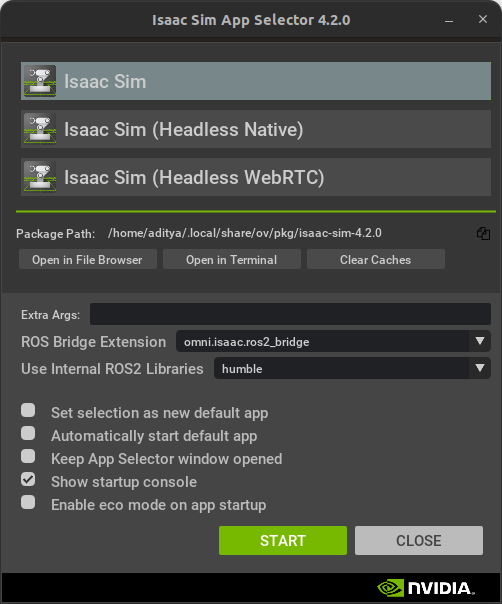
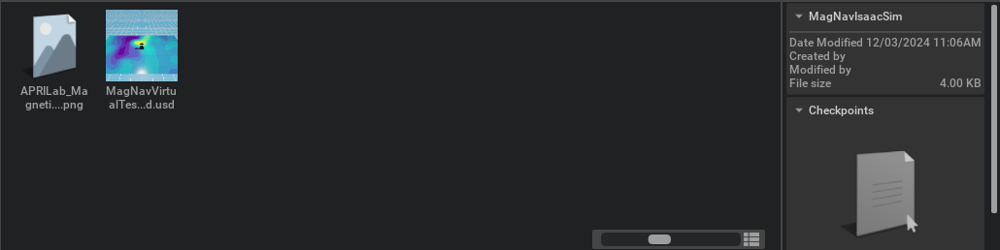
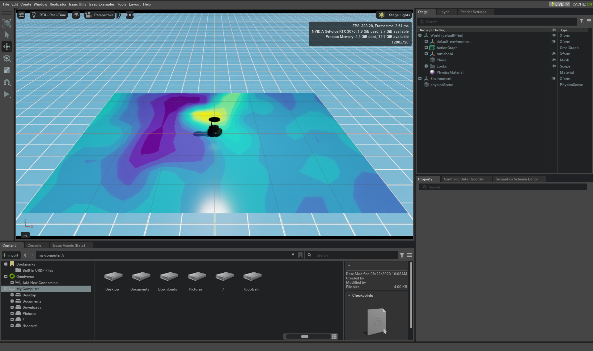

<center>Localization using magnetic anomalies is a promising approach for GPS-denied navigation, particularly in challenging environments such as indoor spaces, heavily forested areas, and long-horizon mission scenarios. However, the high cost of precision magnetometers and the complexities of calibration, influenced bydistortions fromboththeplatformandthesurrounding environment, present notable challenges like wider access for the broader community and the rapid advancement of research in the field. Additionally, representative simulations of precision magnetometers are scarce, if not unavailable. However, simulating magnetic readings is not straightforward, at least not with the accuracies that GPS-denied navigation would require. Given the challenges in accurately modeling the interaction between magnetic fields and robots—particularly as current models often fall short for many applications—this paper introduces a neural network-based sensor model designed to account for environmental factors and internal and external magnetic field influences. The proposed approach also includes a virtual experimental framework implemented in NVIDIA Omniverse, providing a simulation environment where realistic, representative sensor measurements can be utilized for research andtesting. This testbed is expected to serve asatoolforinvestigating magnetic-based navigation algorithms without requiring extensive physical setups. This testbed is released publically for researchers to access and implement novel navigation and localization architectures. [C</center>

### Installation of Isaac Sim Environment

To run the simulation environment please visit the [Github Repo](https://github.com/aprilab-uf/magnav_isaac_sim.git) for the environment provided. The installation instructions given in the repo are mirrored here.

To install the Isaac Sim MagNav Sim, first download the repo to create the environment. Extract these files to a folder you can easily locate: `/home/user/MagNavIsaacSim`

To run the robot sim environment, open NVIDIA's Omniverse launcher and run Isaac Sim with the ROS2 Bridge Extension



Then navigate to the folder you extracted the files to in either the content explorer, or from `File->Open`. You will see the two following assets in the extracted folder:



Open the file called `MagNavVirtualTestbed.usd` which contains the environment used. You will see the environment which looks as follows:



You can now move onto the ROS2 package installation to control the robot in the virtual environment.


### Installation of Neural Based Magnetometer

To run the simulated magnetometer please visit the [Github Repo](https://github.com/aprilab-uf/magnetometer-sim) for the magnetometer simulation provided. The installation instructions given in the repo are mirrored here.

To install the package you must `git clone` the repository into your workspace. This can be done as follows:

````bash
mkdir -p nn_magnetometer_ws/src && cd nn_magnetometer_ws/src
git clone https://github.com/aprilab-uf/nn_magnetometer
cd ../
colcon build --symlink-install
````

This will clone and build the package into the workspace. Do remember to source the workspace once you are done building to ensure you can see the package nodes. To run the magnetometer and a path follower to test the performance of the NN-based magnetometer run the following launch file (ensure the Isaac Sim environment is running live):

````bash
ros2 launch nn_magnetometer nn_test_sim.launch.yaml robot_namespace:="robot"
````

#### `nn_magnetometer_node`

To run the nn_magnetometer node, the easiest way is to run the launch file given. Some `{robot_namespace}` is required to namespace the topics. Make sure they are consistent between nodes you want to use. Once the package has been built you will have to have the following topics publishing:

* `/{robot_namespace}/enu/pose`
* `/{robot_namespace}/odom`
* `/{robot_namespace}/imu`
* `/{robot_namespace}/battery_state` - Only runs on the physical robot, so will not be published if running in Isaac Sim, ensure the parameter `sim` is set to `true`

Then you can run the following to launch the node:

````bash
ros2 launch nn_magnetometer nn_magnetometer.launch.yaml robot_namespace:="<robot_name>"
````

An example for the `robot_name` is:

````bash
ros2 launch nn_magnetometer nn_magnetometer.launch.yaml robot_namespace:="robot"
````


Now if you check the ROS 2 topics being published you should see a `/robot/qtfm/field` topic show up. 

The following are the parameters and descriptions required for the node:

* `robot_namespace`  - The robot name to ensure the topics are namespaced appropriately. Default is `robot`.
* `model_name` - The name of the models that are contained within the `data/models`. Default is `nn_magnetometer_model_v0.0.1.pth`.
* `save_json` - Whether to save a JSON file that contains all the topics (subscribed and published) that the node receives. Default is `false`.
* `sim` - Whether or not this is running in a simulation environment. Default is `true`.
* `data_type` - The name of the data type for saving the JSON file. It helps distinguish between multiple runs.

#### `path_follower_node`

Available in this package is also a path follower node that subscribes to a `/{robot_namespace}/enu/pose` topic and publishes a `/{robot_namespace}/cmd_vel` topic for a TurtleBot4. These topic conventions follow what is expected on a TurtleBot4. To run this path follower the following topics need to be subscriptable:

* `/{robot_namespace}/enu/pose`

Then a launch file can be used to launch the path following node as follows:

````bash
ros2 launch nn_magnetometer path_follower.launch.yaml robot_namespace:="<robot_name>"
````

The following are the parameters and descriptions required for the node:

* `robot_namespace`  - The robot name to ensure the topics are namespaced appropriately. Default is `robot`.
* `stanley_gain`  - The stanley gain of the controller. This gain controls how closely the robot follows a predefined path. Tune if the controller is oscillating. Default is `0.001`.
* `linear_velocity` - The linear velocity of the TurtleBot4, i.e. `linear.x` field in the `Twist` for `/{robot_namespace}/cmd_vel`. Default is `0.2`.
* `do_loop` - Whether the path should be executed continuously. Default is `false`.
* `flip_path` - If you want to flip the path to execute a different path compared the predefined ones. Default is `false`.
* `continuous` - Whether the path is continuous or not. This means does the path end and start connect, if not the program will flip the path and add it back to the original path. Default is `true`.
